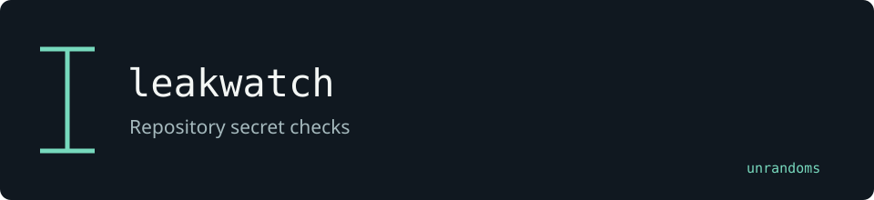

# leakwatch

Scans source files for candidate credentials. The local additions provide Azure and GCP detectors and SARIF output for code-review tooling.

Maintained by [unrandoms](https://github.com/unrandoms), derived from [Yelp/detect-secrets](https://github.com/Yelp/detect-secrets).

## Fork-specific work

- [`detect_secrets/plugins/azure_credentials.py`](detect_secrets/plugins/azure_credentials.py)
- [`detect_secrets/plugins/gcp_service_account.py`](detect_secrets/plugins/gcp_service_account.py)
- [`detect_secrets/output/sarif.py`](detect_secrets/output/sarif.py)

## Validation and limits

Findings are candidate credentials. SARIF output must not expose the plaintext secret; review and rotation remain separate operations.

This documentation update does not certify all inherited features. The [archived reference](UPSTREAM_README.md) describes the original ecosystem; its package names and release links may target upstream rather than this fork.

## Credits

See [CREDITS.md](CREDITS.md) for the distinction between the original implementation and this fork's adaptations. Original licenses and copyright notices remain in the repository.
